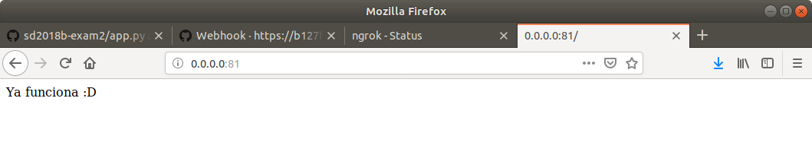
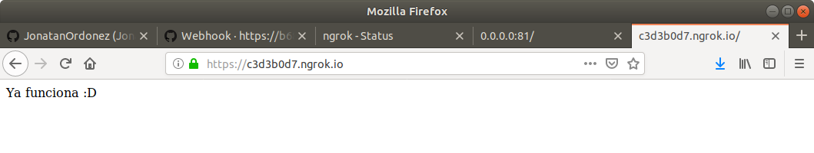

# sd2018b-exam2
## Examen 2
**Universidad ICESI**  
**Course:** Sistemas Distribuidos  
**Teacher:** Daniel Barragán C.  
**Topic:** Automatización de infraestructura  
**Teacher's email:** daniel.barragan at correo.icesi.edu.co  
**Student:** Jonatan Ordoñz Burbano  
**Banner code:** A00054000  
**Repository:** https://github.com/JonatanOrdonez/sd2018b-exam2/tree/jordonez/exam2

## Description
The following document describes the implementation of a ci server responsible for creating a docker image each time a pull request is made to a repository and uploading it to a registry server from which it can be downloaded.

The created containers will work in the following way: every time a pull request is done from the ``develop-merge`` branch, a github webhook will send a payload to the ``ci_service`` that will validate if the pull request made has been merged. When the pull request has been merged, the ``ci_service`` will create a docker image from the uploaded ``Dockerfile`` and the information from the ``dockerInfo.json``, which will be uploaded to a registry server.

### Docker compose
In the repository there is a file called ``docker-compose.yml``, which is responsible for building three docker services. The first service is a ci_service that is responsible for creating
and uploading a docker image from a configuration file called ``'dockerInfo.json'`` to a docker registry image server. The second service is ``ngrok_service``, which is responsible for creating an internet tunnel to our ``ci_service``; this allows to a github webhook to send a payload with information of all the pull requests made to our repository. The last service is the ``registry_service``, which allows us to create a storage space for docker images, which we can later use to create our containers.

The docker-compose.yml file is located in the root of this repository. The content of the file is shown below.

```
version: "3"
services:
  ci_service:
    build: ./ci_service
    ports:
      - "81:80"
    volumes:
      - /var/run/docker.sock:/var/run/docker.sock
  ngrok_service:
    image: wernight/ngrok
    ports:
      - "82:4040"
    links:
      - ci_service
    environment:
      NGROK_PORT: ci_service:80
  registry_service:
    restart: always
    image: registry:2
    ports:
      - "83:5000"
```
To create the containers we execute the following commands in the same order:
```
docker-compose build
```
```
docker-compose up
```
In the following image you can see that services are created correctly:


**The creation of each service in detail is explained below.**

### Ngrok service
This service is built through the docker-compose file, wich takes the base image ``wernight/ngrok`` from docker hub. In the docker-compose the 82 port is mapped to 4040 container port, in which the ngrok service is hosted. A redirection of ports is also made, so the requests made to the ``ngrok_service`` are redirected to 80 port of the ``ci_service``. This process is made explicit in the line ``NGROK PORT: ci_service: 80``. In addition to creating a tunnel to our pc, the ``wernight/ngrok`` image provides a GUI that shows the IP through which we can access our server.

In the following image it can be seen that when accessing ``0.0.0.0:82`` a GUI with the ngrok information appears:


**Note:** Unlike the first partial, this base image makes it very easy for us to create a tunnel that communicates our server to internet, since basically ... we don't have to make the manual process.

### Ci service
In the ``docker-compose`` file we can see that the 81 port of the computer is mapped with 80 port of the container; this is done because internally a flask api is deployed and is exposed on 80 port. In addition, the ``docker.sock`` file is copied from the ``/var/run/`` folder to allow the container to communicate with docker through a socket and build an image.

#### Ci service Dockerfile
The image for this service is created from a Dockerfile in the ``/ci_service`` folder. This file contains the following:
```
# take the 'python:3.6-slim' base image for the container
FROM python:3.6-slim

# generate a server folder
WORKDIR /server

# copy the files of the current folder inside de docker container in '/server' folder
COPY . /server

# install the dependencies in requirements.txt: Flask and Docker
RUN pip install -r requirements.txt

# expose the 80 port for listen requests
EXPOSE 80

# execute the command 'python server.py' for execute the server service
CMD ["python", "server.py"]
```
The base image used to create the ``ci_service`` is ``python: 3.6-slim`` from docker hub, which already comes with python 3.6 that is necessary to deploy our flask service. The dockerfile specifies the creation of a folder inside the container called ``/server``, where the ``server.py`` and the ``requirements.txt`` will be stored. Then the dependencies of the requirements file are installed and finally the server is raised through the command ``python server.py``.

#### Ci service server.py
This file contains the necessary code to receive and read a payload from a github webhook, which contains the pull request information made to the repository.

After processing the pull request information, this is validated whether or not it has been merged to the branch. If it has been merged, a docker image is created from the Dockerfile base file in the ``develop-merge`` branch. Then an image is uploaded to the registry using the name of the service and version as found in the ``dockerInfo.json`` file contained in the branch that we want to mix.

In the following image we can see the ci_service working by accessing the ``0.0.0.0:81`` ip:



In addition, we can also access the ``ci_service`` through ``https://c3d3b0d7.ngrok.io`` that is exposed by the ngrok service through port addressing to the ci service. In the following image you can see this working:



#### Registry service
This service is created from the docker hub base image ``registry image:2``. In the configuration of the docker-compose it is specified to always restart, allowing the service to be executed every time there is a failure. Finally, a mapping of the 83 port of the host computer to the 5000 container port is done.
