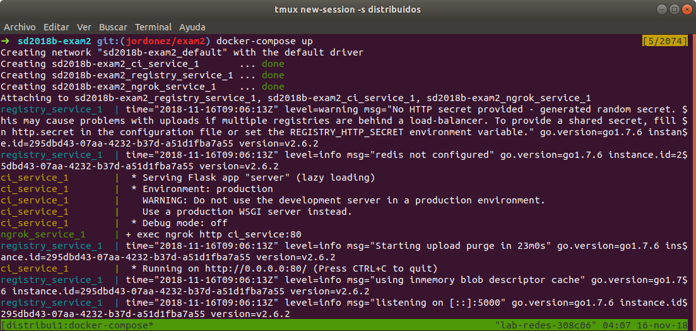

# sd2018b-exam2
### Examen 2
**Universidad ICESI**  
**Course:** Sistemas Distribuidos  
**Teacher:** Daniel Barragán C.  
**Topic:** Automatización de infraestructura  
**Teacher's email:** daniel.barragan at correo.icesi.edu.co  
**Student:** Jonatan Ordoñz Burbano  
**Banner code:** A00054000  
**Repository:** https://github.com/JonatanOrdonez/sd2018b-exam2/tree/jordonez/exam2

### Description
The following document describes the implementation of a ci server responsible for creating a docker image each time a pull request is made to a repository and uploading it to a registry server from which it can be downloaded.

### Description of docker compose
In the repository there is a file called ``docker-compose.yml``, which is responsible for building three docker services. The first service is a ci_service that is responsible for creating
and uploading a docker image from a configuration file called ``'dockerInfo.json'`` to a docker registry image server. The second service is ``ngrok_service``, which is responsible for creating an internet tunnel to our ``ci_service``; this allows to a github webhook to send a payload with information of all the pull requests made to our repository. The last service is the ``registry_service``, which allows us to create a storage space for docker images, which we can later use to create our containers.

#### Docker compose file
The docker-compose.yml file is located in the root of this repository. The content of the file is shown below.

```
version: "3"
services:
  ci_service:
    build: ./ci_service
    ports:
      - "81:80"
    volumes:
      - /var/run/docker.sock:/var/run/docker.sock
  ngrok_service:
    image: wernight/ngrok
    ports:
      - "82:4040"
    links:
      - ci_service
    environment:
      NGROK_PORT: ci_service:80
  registry_service:
    restart: always
    image: registry:2
    ports:
      - "83:5000"
```
To create the containers we execute the following commands in the same order:
```
docker-compose build
```
```
docker-compose up
```
In the following image you can see that services are created correctly:



**The creation of each service in detail is explained below.**
##### Ngrok service
This service is built through the docker-compose file, wich takes the base image ``wernight/ngrok`` from docker hub. In the docker-compose the 82 port is mapped to 4040 container port, in which the ngrok service is hosted. A redirection of ports is also made, so the requests made to the ``ngrok_service`` are redirected to 80 port of the ``ci_service``. This process is made explicit in the line ``NGROK PORT: ci_service: 80``. In addition to creating a tunnel to our pc, the ``wernight/ngrok`` image provides a GUI that shows the IP through which we can access our server.

In the following image it can be seen that when accessing ``0.0.0.0:82`` a GUI with the ngrok information appears:


**Note:** Unlike the first partial, this base image makes it very easy for us to create a tunnel that communicates our server to internet, since basically ... we don't have to make the manual process.

##### Ci service
In the ``docker-compose`` file we can see that the 81 port of the computer is mapped with 80 port of the container; this is done because internally a flask api is deployed and is exposed on 80 port. In addition, the ``docker.sock`` file is copied from the ``/var/run/`` folder to allow the container to communicate with docker through a socket and build an image. Later I will talk about the construction of the container from the ``/ci_service`` folder.

In the following image we can see the ci_service running by accessing the ``0.0.0.0:81`` ip:


In addition, we can also access the ``ci_service`` through ``https://c3d3b0d7.ngrok.io`` that is exposed by the ngrok service through port addressing to the ci service. In the following image you can see this working:


##### Registry service
El te
